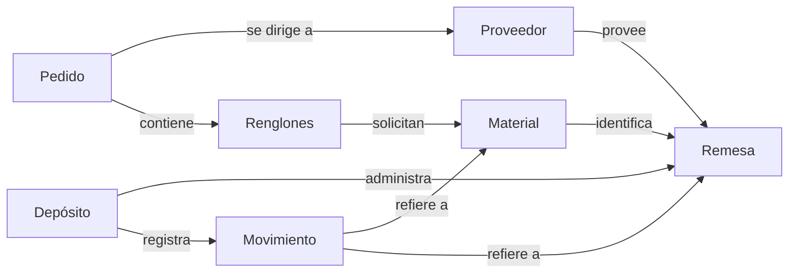
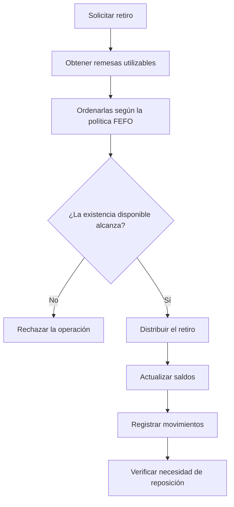

# Trabajo Práctico: Sistema de Inventario JIT con Trazabilidad

## Situación Hipotética

**AeroTech Components** fabrica componentes para la industria aeronáutica y abastece sus líneas de producción mediante un esquema de inventario Just-In-Time (JIT). Los materiales ingresan al depósito en remesas provenientes de distintos proveedores y, en muchos casos, poseen fecha de vencimiento.

Actualmente, los ingresos y retiros se registran en planillas independientes. Como consecuencia, resulta difícil conocer con precisión qué materiales continúan disponibles para producción, reconstruir el origen de un consumo específico o determinar si un lote vencido fue utilizado por error. Además, los responsables del depósito suelen detectar los faltantes cuando la producción ya se encuentra afectada.

La empresa solicita desarrollar un prototipo que permita administrar el inventario preservando la trazabilidad completa de cada movimiento. El sistema deberá registrar el ingreso de remesas, determinar qué existencias pueden utilizarse en una fecha determinada, retirar materiales respetando una política de consumo explícita y advertir cuándo un material requiere reposición.

El sistema **no deberá decidir automáticamente qué comprar ni emitir pedidos a proveedores**. Su objetivo consiste en mantener información consistente sobre el inventario disponible y facilitar las decisiones posteriores de abastecimiento.

## Objetivo del sistema

El prototipo deberá permitir:

- registrar materiales, proveedores y remesas;
- consultar existencias físicas y existencias disponibles para una fecha determinada;
- retirar materiales respetando una política explícita de consumo;
- conservar la trazabilidad completa de los ingresos y retiros realizados;
- reconstruir qué remesas participaron en un retiro y cómo fue consumida cada remesa a lo largo del tiempo;
- detectar materiales cuya existencia disponible haya descendido por debajo de su punto de reposición;
- confeccionar pedidos a proveedores y calcular su importe total.

### Alcance y vocabulario del dominio

Los siguientes conceptos delimitan el problema que debe resolverse, pero **no implican necesariamente una clase por cada sustantivo**. Parte del trabajo consiste en decidir cómo representar este vocabulario mediante objetos y cómo distribuir adecuadamente sus responsabilidades.

| Concepto          | Representa                                                          | Información asociada                                                                          | No implica                                |
| ----------------- | ------------------------------------------------------------------- | ------------------------------------------------------------------------------------------ | --------------------------------------------------- |
| Material          | Un tipo de insumo utilizado por la empresa                          | Su identidad, nombre, unidad de medida y punto de reposición                               | Decidir desde qué remesas debe consumirse           |
| Proveedor         | Una empresa que suministra materiales                               | Su identidad y plazo estimado de entrega                                                   | Administrar existencias o movimientos               |
| Remesa            | Una partida específica recibida de un proveedor                     | Material contenido, cantidad recibida, saldo disponible, fechas de recepción y vencimiento | Elegir cuándo debe consumirse dentro del inventario |
| Depósito          | El inventario administrado por el sistema                           | Registrar remesas, coordinar consultas y retiros, conservar la trazabilidad                | Decidir automáticamente qué materiales comprar      |
| Movimiento        | Un hecho ocurrido sobre el inventario                               | Registrar un ingreso o un retiro con toda su información asociada                          | Modificar posteriormente el estado del inventario   |
| Pedido            | Una solicitud dirigida a un proveedor                               | Agrupar materiales solicitados y calcular su importe total                                 | Incorporar existencias antes de recibirlas          |
| Renglón de pedido | Una cantidad solicitada de un material junto con su precio acordado | Calcular su subtotal                                                                       | Modificar el inventario o seleccionar proveedores   |

El mapa anterior resume únicamente las relaciones existentes entre los conceptos del dominio.

**No constituye un diagrama de clases UML ni prescribe asociaciones, jerarquías de herencia, navegabilidad, estructuras de datos o distribución de responsabilidades entre clases**. Estas decisiones forman parte del diseño orientado a objetos que deberá proponer la solución.

### Flujo principal del retiro de materiales

Cuando se solicita retirar una determinada cantidad de un material para una fecha de operación, el sistema deberá determinar primero qué remesas pueden utilizarse.

Se consideran utilizables únicamente aquellas remesas que:

- poseen saldo disponible;
- no se encuentran vencidas en la fecha indicada.

A continuación, dichas remesas deberán ordenarse según la política de consumo definida para el sistema. En esta primera versión, la política será **FEFO (First Expired, First Out)**.

La distribución del retiro deberá respetar íntegramente la política de consumo establecida.

Si durante las validaciones se detecta cualquier incumplimiento de las reglas de negocio, **la operación deberá rechazarse sin producir modificaciones parciales sobre el inventario.**

### Política FEFO

En esta primera versión del sistema, las remesas deberán consumirse siguiendo el criterio **First Expired, First Out (FEFO)**.

Esta política establece que:

- primero se consumen las remesas cuya fecha de vencimiento sea más próxima;
- cuando varias remesas posean el mismo vencimiento, se priorizará aquella cuya fecha de recepción sea anterior;
- si aún persistiera un empate, se utilizará el identificador de la remesa como último criterio de orden.

Las remesas que **no poseen fecha de vencimiento** deberán consumirse después de todas aquellas que sí la poseen. Entre ellas también se utilizarán la fecha de recepción y el identificador para resolver eventuales empates.

La política FEFO determina únicamente el orden en que deben consumirse las remesas.

No decide si un retiro puede realizarse ni modifica las reglas de disponibilidad del inventario.

### Fuera de alcance

El presente trabajo práctico **no contempla**:

- interfaz gráfica de usuario;
- persistencia en archivos o bases de datos;
- múltiples depósitos físicos;
- reservas de stock;
- devoluciones de materiales;
- múltiples monedas, impuestos o descuentos;
- integración con proveedores;
- emisión automática de pedidos;
- cálculo automático de cantidades de compra;
- pronósticos de demanda;
- auditoría de usuarios o permisos de acceso.

Asimismo, el sistema no deberá optimizar automáticamente el inventario ni reemplazar las decisiones de abastecimiento realizadas por los responsables de la empresa.

## Requerimientos Técnicos Obligatorios

El objetivo principal de este trabajo práctico consiste en aplicar los conceptos de **Programación Orientada a Objetos, Estructuras de Datos y Buenas Prácticas de Diseño** estudiados durante la materia.

Las decisiones de diseño adoptadas deberán justificarse mediante una implementación consistente, mantenible y alineada con los principios vistos en clase. No existe una única solución correcta; sin embargo, las decisiones tomadas deberán respetar las reglas de negocio y los requerimientos técnicos establecidos en esta consigna.

### Diseño orientado a objetos

La solución deberá modelar el dominio mediante objetos que representen adecuadamente los conceptos del problema y distribuyan sus responsabilidades de forma coherente.

En particular, se espera que:

- cada clase posea una responsabilidad claramente definida y relacionada con el dominio;
- las responsabilidades se encuentren adecuadamente distribuidas entre los objetos, evitando concentrar la lógica del sistema en una única clase;
- cada objeto sea responsable de mantener la consistencia de su propio estado;
- el diseño favorezca un bajo acoplamiento y una alta cohesión entre las clases.

La utilización de atributos públicos que permitan modificar directamente el estado interno de los objetos no forma parte del enfoque esperado para este trabajo práctico.

### Encapsulamiento

El estado interno de cada objeto deberá protegerse mediante una interfaz pública apropiada.

Las validaciones necesarias para preservar la consistencia de cada objeto deberán realizarse dentro del propio objeto responsable de dicha información y no depender del código cliente.

### Herencia y polimorfismo

La solución deberá incorporar mecanismos de reutilización propios de la Programación Orientada a Objetos.

Cuando existan comportamientos comunes entre diferentes objetos, deberá evaluarse la conveniencia de utilizar composición, herencia u otros mecanismos de diseño.

Asimismo, deberá implementarse al menos un comportamiento polimórfico cuya utilización permita extender el sistema sin modificar el código cliente que hace uso de dicho comportamiento.

La presente consigna no prescribe una jerarquía de herencia determinada. La conveniencia y el alcance de su utilización forman parte de las decisiones de diseño que deberán adoptarse.

### Excepciones

Las situaciones que representen violaciones a las reglas de negocio deberán informarse mediante excepciones apropiadas.

Cada excepción deberá representar una condición de error claramente identificable y permitir que el código cliente pueda actuar en consecuencia.

No se espera que el sistema continúe ejecutando operaciones inválidas ni que utilice valores especiales como mecanismo principal para indicar errores de negocio.

### Estructuras de datos

Las estructuras de datos seleccionadas deberán ser consistentes con las operaciones que el sistema necesita realizar.

Su elección deberá responder a necesidades concretas del problema y no a decisiones arbitrarias.

### Modularización

La solución deberá organizarse en módulos de manera coherente.

Cada módulo deberá agrupar elementos relacionados y evitar dependencias innecesarias con otros módulos del sistema.

Se espera una separación clara entre los distintos componentes de la solución, favoreciendo la legibilidad, el mantenimiento y la evolución del código.

### Biblioteca estándar

La implementación deberá realizarse utilizando únicamente la biblioteca estándar de Python, salvo indicación expresa de la cátedra.

No podrán utilizarse bibliotecas externas para resolver funcionalidades que forman parte de los objetivos de aprendizaje del trabajo práctico.

### Pruebas unitarias

El proyecto deberá incluir pruebas unitarias desarrolladas con **pytest**.

Las pruebas deberán verificar tanto el comportamiento esperado del sistema como las principales situaciones de error contempladas por las reglas de negocio.

No se evaluará únicamente la cantidad de pruebas implementadas, sino también su capacidad para validar el correcto funcionamiento de los distintos componentes del sistema.

### Evolución del diseño

A lo largo del semestre, la cátedra incorporará nuevos requerimientos funcionales sobre este mismo sistema.

En consecuencia, el diseño inicial deberá favorecer la incorporación de nuevas funcionalidades procurando minimizar el impacto sobre el código existente.

No se espera que la solución anticipe todos los cambios posibles, pero sí que las decisiones de diseño adoptadas faciliten su evolución sin requerir modificaciones innecesarias en componentes ya implementados.

### Observaciones generales

La presente consigna describe qué comportamiento debe ofrecer el sistema, pero no prescribe cómo debe implementarse.

En particular, la cátedra **no establece**:

- la cantidad de clases que deberá tener la solución;
- la existencia de determinadas jerarquías de herencia;
- las asociaciones entre objetos;
- la navegabilidad entre clases;
- las estructuras de datos que deban utilizarse para representar cada colección;
- la distribución específica de responsabilidades entre las clases.

Estas decisiones forman parte del diseño orientado a objetos propuesto y constituyen un aspecto central de la evaluación del trabajo práctico.

## Reglas de Negocio

Las siguientes reglas describen el comportamiento funcional esperado del sistema.

Estas reglas **constituyen la especificación del dominio** y deberán cumplirse independientemente del diseño orientado a objetos adoptado.

#### Materiales

- RN1. Cada material deberá poseer un identificador único dentro del sistema.

- RN2. Cada material deberá registrar, como mínimo, su nombre, unidad de medida y punto de reposición.

- RN3. El punto de reposición deberá ser un valor mayor que cero.

#### Proveedores

- RN4. Cada proveedor deberá poseer un identificador único dentro del sistema.

- RN5. Cada proveedor deberá registrar, como mínimo, su nombre y plazo estimado de entrega.

#### Remesas

- RN6. Cada remesa deberá poseer un identificador único dentro del sistema.

- RN7. Cada remesa corresponderá a un único material y a un único proveedor.

- RN8. Toda remesa deberá registrar la cantidad recibida y su saldo disponible.

- RN9. La cantidad recibida deberá ser mayor que cero.

- RN10. El saldo disponible nunca podrá ser negativo.

- RN11. El saldo disponible nunca podrá superar la cantidad originalmente recibida.

- RN12. Al registrarse una remesa, su saldo disponible deberá coincidir con la cantidad recibida.

- RN13. Una remesa podrá no poseer fecha de vencimiento.

- RN14. Una remesa cuyo saldo disponible llegue a cero continuará formando parte del inventario registrado, aunque dejará de ser utilizable para futuros retiros.

#### Disponibilidad

- RN15. La existencia física de un material corresponderá a la suma de las cantidades disponibles en todas sus remesas, independientemente de su fecha de vencimiento.

- RN16. La existencia disponible para una fecha determinada corresponderá a la suma de los saldos disponibles de todas las remesas utilizables en dicha fecha.

- RN17. Una remesa será considerada utilizable para una fecha determinada únicamente cuando:

    - posea saldo disponible;
    - no se encuentre vencida en dicha fecha.

#### Retiros

- RN18. Un retiro sólo podrá realizarse cuando la existencia disponible resulte suficiente para satisfacer completamente la cantidad solicitada.

- RN19. Los retiros deberán consumir las remesas respetando la política FEFO definida para el sistema.

- RN20. Un retiro podrá distribuir su consumo entre una o más remesas.

- RN21. Cada retiro deberá actualizar el saldo disponible de todas las remesas efectivamente consumidas.

- RN22. Si un retiro no pudiera realizarse, el inventario deberá permanecer exactamente en el mismo estado en que se encontraba antes de iniciarse la operación.

#### Trazabilidad

- RN23. El registro de una remesa deberá generar el correspondiente movimiento de ingreso.

- RN24. Cada retiro deberá generar un movimiento por cada remesa efectivamente consumida.

- RN25. El sistema deberá permitir identificar todas las remesas que participaron en un retiro determinado.

- RN26. El sistema deberá permitir identificar todos los retiros en los que intervino una remesa determinada.

#### Reposición

- RN27. Un material requerirá reposición cuando su existencia disponible resulte inferior a su punto de reposición.

- RN28. La necesidad de reposición deberá determinarse utilizando la existencia disponible y no la existencia física.

#### Pedidos

- RN29. Un pedido corresponderá a un único proveedor.

- RN30. Un pedido podrá contener uno o más renglones.

- RN31. Cada renglón deberá indicar el material solicitado, la cantidad requerida y el precio unitario acordado.

- RN32. El subtotal de cada renglón corresponderá al producto entre la cantidad solicitada y el precio unitario.

- RN33. El importe total del pedido corresponderá a la suma de los subtotales de todos sus renglones.

## Ejemplo de aceptación

El siguiente ejemplo **no describe una implementación posible**, sino un escenario que permite verificar el cumplimiento de diversas reglas de negocio.

Los nombres, cantidades y fechas utilizados tienen únicamente fines ilustrativos.

#### Estado inicial

El sistema registra el siguiente material:

| Material       | Punto de reposición |
| -------------- | ------------------: |
| Aluminio AL-01 |               10 kg |

Y las siguientes remesas:

| Remesa | Cantidad recibida | Saldo disponible | Recepción  | Vencimiento     |
| ------ | ----------------: | ---------------: | ---------- | --------------- |
| R-101  |              8 kg |             8 kg | 02/03/2026 | 20/03/2026      |
| R-102  |             12 kg |            12 kg | 04/03/2026 | 30/03/2026      |
| R-103  |             15 kg |            15 kg | 05/03/2026 | Sin vencimiento |

La existencia física del material es **35 kg**.

Para una operación realizada el **10/03/2026**, todas las remesas resultan utilizables.

La existencia disponible también es **35 kg**.

#### Primer escenario

Se solicita retirar **18 kg** del material **AL-01** con fecha **10/03/2026**.

El retiro resulta válido porque la existencia disponible es suficiente.

La política **FEFO** determina el siguiente consumo:

| Remesa | Cantidad consumida | Saldo restante |
| ------ | -----------------: | -------------: |
| R-101  |               8 kg |           0 kg |
| R-102  |              10 kg |           2 kg |
| R-103  |               0 kg |          15 kg |

La remesa **R-101** permanece registrada en el sistema para preservar la trazabilidad, aunque deja de ser utilizable para futuros retiros.

La existencia física pasa a ser **17 kg** y la existencia disponible para esa fecha también resulta **17 kg**.

Como la existencia disponible continúa siendo superior al punto de reposición, no corresponde realizar una reposición.

Asimismo, el sistema registra:

- un movimiento correspondiente al ingreso de cada remesa;
- dos movimientos asociados al retiro realizado, uno por cada remesa efectivamente consumida.

En consecuencia, el sistema permite conocer:

- qué remesas participaron en el retiro;
- todos los retiros en los que intervino cada remesa.

#### Segundo escenario

Supóngase ahora que el día **05/04/2026** se solicita retirar **5 kg** del mismo material.

En esa fecha:

- la remesa **R-101** no será considerada porque no posee saldo disponible;
- la remesa **R-102** tampoco será considerada porque se encuentra vencida;
- la remesa **R-103** continúa siendo utilizable.

En consecuencia, la política **FEFO** determina que el retiro se realice íntegramente utilizando la remesa **R-103**.

| Remesa | Cantidad consumida | Saldo restante |
| ------ | -----------------: | -------------: |
| R-103  |               5 kg |          10 kg |

La existencia física del material pasa a ser **12 kg**, mientras que la existencia disponible para esa fecha resulta **10 kg**.

#### Tercer escenario

Si posteriormente se solicita retirar **20 kg** del mismo material con fecha **05/04/2026**, la operación deberá rechazarse.

Aunque el inventario conserve existencia física del material, la existencia disponible para esa fecha no alcanza para satisfacer completamente la cantidad solicitada.

El rechazo **no deberá modificar** el saldo de ninguna remesa ni registrar consumos parciales.

### Pruebas mínimas esperadas

Independientemente del diseño adoptado, la solución deberá ser capaz de resolver correctamente, como mínimo, los siguientes escenarios.

Estos casos **no constituyen una lista exhaustiva**. La solución deberá incluir las pruebas unitarias adicionales que resulten necesarias para demostrar el correcto funcionamiento del sistema.

#### Materiales y proveedores

- Registrar materiales con identificadores únicos.
- Impedir el registro de materiales con identificadores duplicados.
- Registrar proveedores con identificadores únicos.
- Impedir el registro de proveedores con identificadores duplicados.

#### Registro de remesas

- Registrar correctamente una remesa válida.
- Verificar que el saldo inicial coincida con la cantidad recibida.
- Impedir el registro de remesas con identificadores duplicados.
- Impedir el registro de remesas con cantidades inválidas.
- Registrar correctamente remesas con y sin fecha de vencimiento.

#### Consulta de existencias

- Calcular correctamente la existencia física de un material.
- Calcular correctamente la existencia disponible para distintas fechas.
- Verificar que las remesas vencidas no integren la existencia disponible.
- Verificar que las remesas agotadas no integren la existencia disponible.

#### Retiros

- Realizar un retiro utilizando una única remesa.
- Realizar un retiro distribuyendo el consumo entre varias remesas.
- Verificar que el consumo respete la política FEFO.
- Impedir retiros cuya cantidad supere la existencia disponible.
- Verificar que un retiro rechazado no produzca modificaciones sobre el inventario.
- Verificar la actualización correcta de los saldos de las remesas consumidas.

#### Trazabilidad

- Verificar que el ingreso de una remesa genere el movimiento correspondiente.
- Verificar que un retiro registre todos los movimientos necesarios para reflejar su distribución entre remesas.
- Recuperar las remesas que participaron en un retiro determinado.
- Recuperar todos los retiros en los que intervino una remesa determinada.

#### Reposición

- Detectar correctamente cuándo un material requiere reposición.
- Verificar que la reposición se determine utilizando la existencia disponible y no la existencia física.

#### Pedidos

- Crear pedidos dirigidos a un proveedor.
- Incorporar uno o más renglones a un pedido.
- Calcular correctamente el subtotal de cada renglón.
- Calcular correctamente el importe total del pedido.

#### Excepciones

- Verificar que las operaciones inválidas produzcan las excepciones correspondientes.
- Verificar que las excepciones no alteren la consistencia del inventario.

## Decisiones de diseño que deberán resolverse

La presente consigna define el comportamiento esperado del sistema, pero deliberadamente deja abiertas diversas decisiones de diseño.

No existe una única solución correcta. Entre otras, la solución deberá resolver cuestiones como las siguientes:

- ¿Qué clases resultan necesarias para representar adecuadamente los conceptos del dominio?
- ¿Cómo distribuir las responsabilidades entre dichas clases procurando mantener un bajo acoplamiento y una alta cohesión?
- ¿Qué relaciones existirán entre los distintos objetos y cómo se establecerá su colaboración?
- ¿Qué estructuras de datos resultan más apropiadas para administrar las distintas colecciones del sistema?
- ¿Cómo representar la política de consumo FEFO de manera que permita incorporar nuevas políticas en futuras versiones del sistema?
- ¿Cómo modelar los distintos tipos de movimientos registrados por el inventario?
- ¿Qué validaciones corresponden a cada objeto para preservar la consistencia de su propio estado?
- ¿Qué situaciones deberán representarse mediante excepciones específicas?
- ¿Qué información deberá exponerse públicamente y cuál deberá permanecer encapsulada?
- ¿Cómo organizar la solución en módulos de manera que facilite su mantenimiento y evolución?
- ¿Qué aspectos del diseño podrán evolucionar durante el semestre con el menor impacto posible sobre el código existente?

Las respuestas a estas preguntas forman parte de la solución propuesta y constituyen un aspecto central de la evaluación del trabajo práctico.

### Evolución durante el semestre

El presente trabajo práctico constituye la primera etapa de un proyecto que evolucionará a lo largo del semestre.

En instancias posteriores, la cátedra incorporará nuevos requerimientos funcionales que ampliarán el comportamiento del sistema y requerirán extender el diseño desarrollado en esta primera versión.

Los nuevos requerimientos serán compatibles con las reglas de negocio definidas en esta consigna, aunque podrán introducir nuevos conceptos, comportamientos o restricciones propios de la evolución del sistema.

No se espera que la solución anticipe todas las modificaciones futuras. Sin embargo, el diseño propuesto deberá favorecer la incorporación de nuevas funcionalidades procurando minimizar el impacto sobre el código existente.

## Notas

- Se prohíbe `pandas` y cualquier librería que resuelva inventarios o trazabilidad; el objetivo es trabajar con listas, diccionarios y algoritmos propios.
- Antes de codificar, presenten un diagrama de responsabilidades y relaciones. El mapa del enunciado no es un diagrama de clases para copiar.
- Deberán justificar las decisiones tomadas y demostrar las reglas mediante pruebas automatizadas.
- Se permite la biblioteca estándar de Python, en particular `datetime` y `decimal`, cuando la representación elegida lo justifique.
